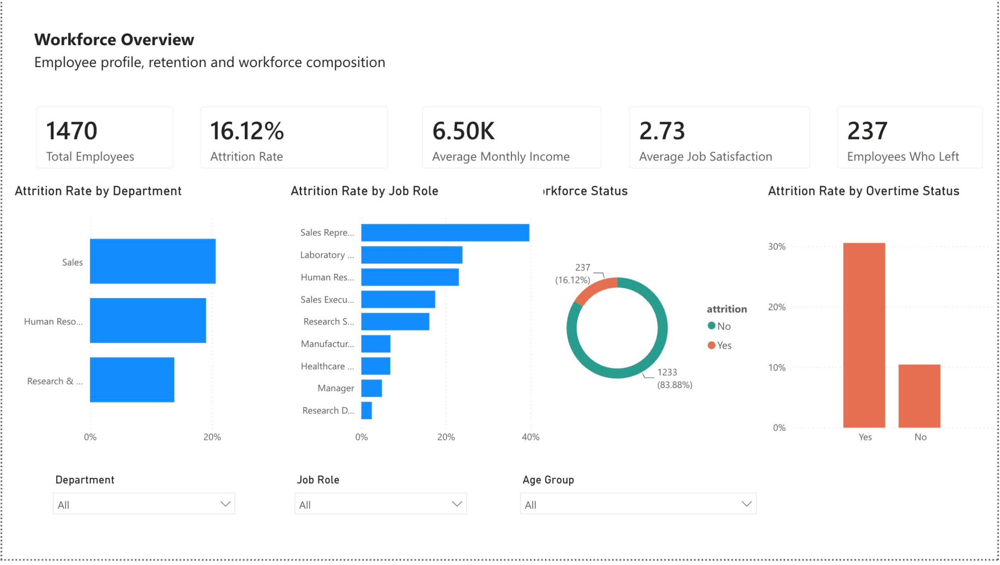
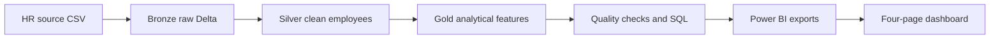
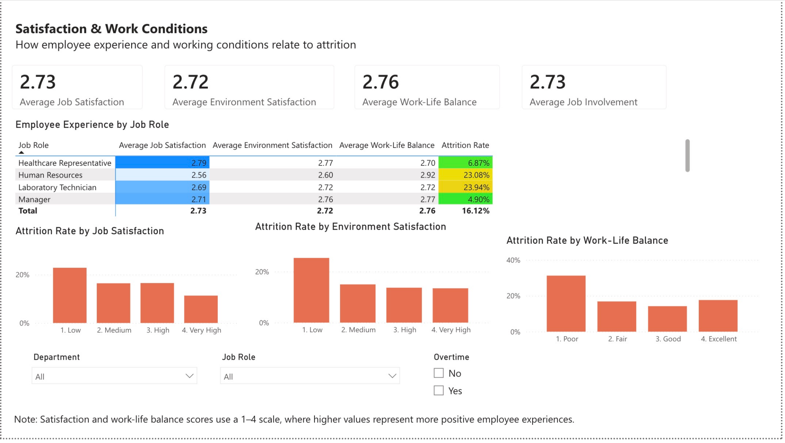
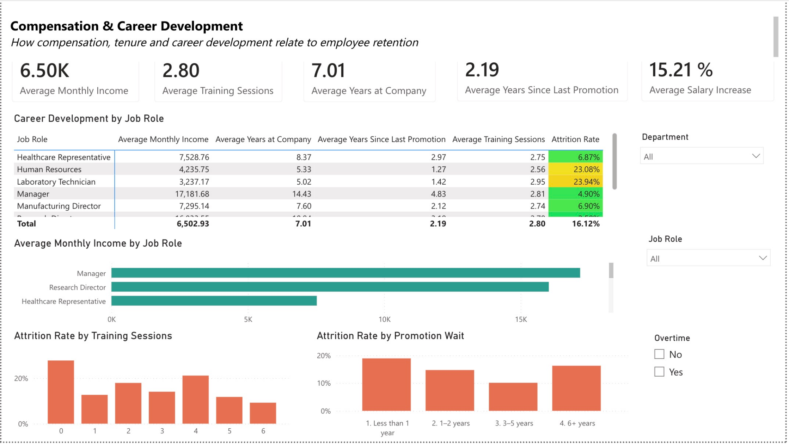
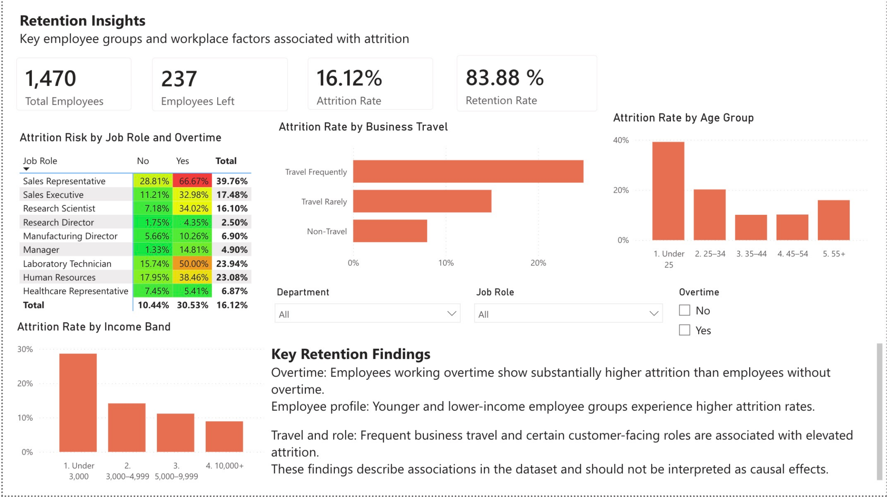

# Employee Attrition & Retention Analytics Dashboard
End-to-end people analytics portfolio project built with **Databricks, PySpark, Spark SQL, Delta Lake, Power BI and DAX**. The solution transforms a fictional IBM HR practice dataset into a validated lakehouse model and a four-page interactive report that explores workforce composition, employee experience, compensation, career development and retention patterns.



> This is an independent portfolio project, not client work. The source data is fictional and does not describe IBM's real workforce. The analysis identifies aggregate associations and must not be interpreted as causal evidence or used for individual employment decisions.

## Project objective

The project was designed to answer six practical HR questions:

1. What is the observed attrition rate in the fictional workforce?
2. Which departments and job roles show higher attrition?
3. How are overtime and business travel associated with attrition?
4. How do satisfaction and work-life balance differ across employee groups?
5. How do income, tenure, training and promotion history relate to retention?
6. Which workforce segments should HR investigate first at an aggregate level?

## Key results

| KPI | Result |
|---|---:|
| Employee records | 1,470 |
| Employees who left | 237 |
| Attrition rate | 16.12% |
| Retention rate | 83.88% |
| Average monthly income | 6,502.93 units |
| Average job satisfaction | 2.73 / 4 |
| Average work-life balance | 2.76 / 4 |
| Average years at company | 7.01 |
| Average training sessions | 2.80 |
| Average salary increase | 15.21% |
| Automated quality status | PASS |

## Technology stack

| Layer | Technology | Purpose |
|---|---|---|
| Source | CSV | Fictional IBM HR Analytics practice dataset |
| Processing | Databricks and PySpark | Ingestion, cleaning, feature engineering and validation |
| Storage | Delta Lake | Bronze, Silver, Gold and quality tables |
| Analysis | Spark SQL | Reusable aggregate workforce analyses |
| Semantic model | Power BI and DAX | Measures, filtering and business calculations |
| Presentation | Power BI | Interactive four-page HR analytics report |

## Architecture



The Databricks implementation uses schema `workspace.hr_portfolio`, a source volume named `source_files` and a separate `power_bi_exports` volume.

### Main Delta tables

| Layer | Table | Purpose |
|---|---|---|
| Bronze | `bronze_hr_employee_raw` | Source-preserving employee rows with lineage metadata |
| Silver | `silver_hr_employees` | Clean, typed and standardized employee data |
| Gold | `gold_hr_employee_analytics` | Enriched employee-level dataset for Power BI |
| Gold | `gold_hr_workforce_summary` | Executive workforce KPI summary |
| Gold | `gold_hr_attrition_drivers` | Aggregate category benchmarks and attrition lift |
| Gold | `gold_hr_department_summary` | Department-level workforce metrics |
| Gold | `gold_hr_job_role_summary` | Job-role-level workforce metrics |
| Quality | `hr_data_quality_checks` | Persisted PASS/FAIL validation results |

## Implementation workflow

### 1. Ingest and clean

`notebooks/01_load_and_clean.py`

- Creates the Unity Catalog schema and source volume.
- Loads the source CSV as strings to preserve raw values in Bronze.
- Converts column names to `snake_case` and validates all 35 expected source fields.
- Trims text values, applies explicit integer types and writes Bronze and Silver Delta tables.
- Adds source-file and ingestion-timestamp metadata for lineage.

### 2. Engineer analytical features

`notebooks/02_feature_engineering_and_metrics.py`

- Creates numeric attrition and retention flags.
- Builds business-friendly age, tenure, income, distance and promotion-wait bands.
- Adds readable labels for satisfaction, involvement, education and work-life balance scales.
- Produces workforce, department and job-role summaries.
- Benchmarks categories against the overall attrition rate using transparent attrition lift.
- Includes a clearly labelled, non-predictive factor indicator for aggregate exploration only.

### 3. Validate and analyse

`notebooks/03_quality_checks_and_sql.py` and `sql/hr_analysis.sql`

Automated checks validate:

- the expected 1,470 source rows and 237 attritions;
- required-field completeness and employee-number uniqueness;
- exact duplicate rows;
- valid Attrition and Overtime categories;
- documented 1-4 satisfaction scales;
- non-negative workforce values;
- consistent company, role, promotion and manager durations;
- source constant fields; and
- the explicit non-predictive status of the descriptive factor indicator.

The reusable SQL library covers executive KPIs, department and job-role comparisons, overtime and travel patterns, employee cohorts, satisfaction measures, compensation and career development.

### 4. Export and model in Power BI

`notebooks/04_export_for_power_bi.py` creates four curated exports:

- `hr_employee_analytics.csv`
- `hr_attrition_drivers.csv`
- `hr_department_summary.csv`
- `hr_job_role_summary.csv`

The report is driven mainly by the employee-level analytical table. Reusable DAX measures calculate headcount, attritions, retention, satisfaction, overtime, compensation and career-development KPIs. The full definitions are available in [`power_bi/measures.dax`](power_bi/measures.dax).

## Dashboard pages

### 1. Workforce Overview

The overview combines workforce KPI cards, attrition by department and job role, a retained-versus-left donut chart, overtime comparison and slicers for department, job role and age group.


### 2. Satisfaction & Work Conditions

This page compares job satisfaction, environment satisfaction, work-life balance and job involvement. A conditional-formatting matrix and three attrition charts make lower-scoring employee-experience categories easy to identify.



### 3. Compensation & Career Development

The third page connects monthly income, tenure, training and promotion history with observed attrition. The job-role matrix supports detailed comparison, while the supporting charts show income and career-development patterns.



### 4. Retention Insights

The final page consolidates the most decision-relevant retention findings. It combines a job-role and overtime risk matrix with business-travel, age-group and income-band comparisons and written analytical callouts.



## Main findings

- **Overtime is the clearest observed retention signal:** attrition is 30.53% among employees working overtime versus 10.44% among employees without overtime.
- **Sales Representatives have the highest job-role attrition:** 39.76% overall and 66.67% within the overtime subgroup.
- **Frequent business travel is associated with higher attrition:** 24.91% for frequent travellers, compared with 14.96% for occasional travellers and 8.00% for non-travellers.
- **Younger employees have higher observed attrition:** the Under-25 group reaches 39.18%, while the 35-44 and 45-54 groups are close to 10%.
- **Lower-income employees show higher attrition:** 28.61% below 3,000 income units, decreasing to 8.90% at 10,000 or above.
- **Employee experience matters:** the lowest job-satisfaction, environment-satisfaction and work-life-balance categories all have visibly higher attrition than the strongest categories.

## Recommended HR follow-up

1. Review overtime workload, staffing levels and manager practices in the highest-attrition roles.
2. Investigate Sales Representative retention with role-specific interviews and workload data.
3. Examine travel frequency, recovery time and flexibility for regularly travelling employees.
4. Strengthen onboarding, career support and manager check-ins for younger and lower-income groups.
5. Track the same KPIs over time in a production system before evaluating intervention impact.

These are investigation priorities, not automated employment decisions. Any production use should include privacy review, fairness monitoring and human oversight.

## Repository structure

```text
hr-analytics-dashboard/
├── README.md
├── GUIDE_FI.md
├── data/
│   ├── README.md
│   └── data_dictionary.md
├── docs/
│   └── Employee_Attrition_Retention_Project_Overview.pdf
├── images/
│   ├── 01_workforce_overview.png
│   ├── 02_satisfaction_work_conditions.png
│   ├── 03_compensation_career_development.png
│   └── 04_retention_insights.png
├── notebooks/
│   ├── 01_load_and_clean.py
│   ├── 02_feature_engineering_and_metrics.py
│   ├── 03_quality_checks_and_sql.py
│   └── 04_export_for_power_bi.py
├── power_bi/
│   ├── dashboard_plan.md
│   └── measures.dax
└── sql/
    └── hr_analysis.sql
```

## How to reproduce the project

1. Download the dataset described in [`data/README.md`](data/README.md).
2. Create schema `workspace.hr_portfolio` and volume `source_files` in Databricks.
3. Upload `WA_Fn-UseC_-HR-Employee-Attrition.csv` to the volume.
4. Run the four notebooks in numerical order.
5. Confirm that `hr_data_quality_checks` reports `MODEL STATUS: PASS`.
6. Import the four exported CSV files into Power BI.
7. Create the DAX measures documented in `power_bi/measures.dax`.
8. Build or review the four report pages using `power_bi/dashboard_plan.md`.

## Assumptions and limitations

- The dataset is fictional and does not represent IBM's real employees.
- The source has no date field, so this project does not fabricate monthly trends or forecasts.
- Income and rate fields are displayed without a currency symbol because the source does not document a currency.
- Results describe aggregate associations in one static sample and do not establish causality.
- The descriptive factor indicator is not a predictive model and must not be used to rank employees or make employment decisions.

## Documentation

- [`GUIDE_FI.md`](GUIDE_FI.md): detailed Finnish implementation guide
- [`docs/Employee_Attrition_Retention_Project_Overview.pdf`](docs/Employee_Attrition_Retention_Project_Overview.pdf): visual English project presentation
- [`power_bi/dashboard_plan.md`](power_bi/dashboard_plan.md): Power BI page and visual specification
- [`power_bi/measures.dax`](power_bi/measures.dax): reusable DAX measures
- [`data/data_dictionary.md`](data/data_dictionary.md): source and engineered field documentation

## Author

**Valtteri Paivinen**

- GitHub: [github.com/valtteripaivinen](https://github.com/valtteripaivinen)
- LinkedIn: [linkedin.com/in/valtteri-paivinen](https://www.linkedin.com/in/valtteri-paivinen)
